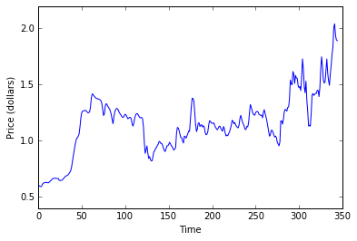
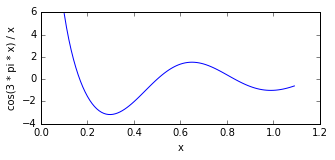
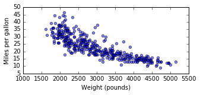
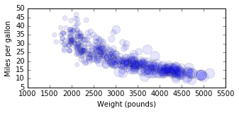
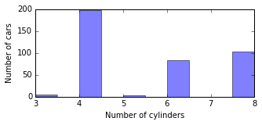
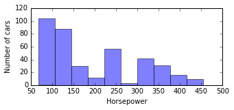
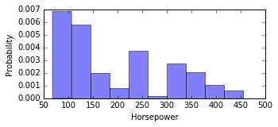

# 操纵和可视化数据

我们已经学习了[加载文件](files.ipynb)的基础知识，现在是时候将加载的数据，从 [NumPy](http://www.numpy.org/) 和 [Pandas](http://pandas.pydata.org/) 重新组织为常用的数据结构了。 为了产生各种数据结构，我们将把它们提供给 [matplotlib](https://matplotlib.org/) 进行可视化。 然后，本实验将全面介绍我们的通用数据科学规划模板中的第 2,3 和 5 步：

1. 获取数据，这意味着找到合适的文件，或从 Web 收集数据并存储在文件中
2. 从磁盘加载数据并放入**组织成数据结构**的内存
3. 规范化，清理或以其他方式**准备数据**
4. 处理数据，这可能意味着训练机器学习模型，计算摘要统计量或优化成本函数
5. 输出结果，可以是简单地将答案保存到磁盘上，也可以生成奇特的**可视化**

您将在机器学习，时间序列分析等课程中了解第 4 步的更多信息。

让我们开始导入我们需要的所有软件包，并设置一些参数，使这个 Jupyter 笔记本看起来更好：

```python
import pandas
import numpy as np
import matplotlib.pyplot as plt

pandas.options.display.max_rows = 7 # Don't display too much data (Pandas)
np.set_printoptions(threshold=4)    # Don't display too much data (NumPy)
```

## 你的新 BFF

分析程序倾向于使用大量的一维和二维数组。2D 数组是矩阵和数据表。1D 数组是向量，例如欧几里德空间中的点。表的列或行也是一维数组。 Python 有列表和列表的列表，可以满足 1D 和 2D 数组，但 Pandas 和 NumPy 定义了类似但功能更强的数据结构。

让我们从 Pandas *数据帧*开始，它们是非常像 Excel 表的强大表格。 我还认为 Pandas 的`read_csv()`是加载组织成行和列的大多数数据的最简单方法。 这是一个示例数据文件，包含一段时间内的价格列表，每行一个数据点且没有标题行：

```python
! wc data/prices.txt
! head data/prices.txt

'''
     345     345    2067 data/prices.txt
0.605
0.600
0.594
0.592
0.600
0.616
0.623
0.628
0.630
0.629
'''
```

（`wc`和`head`是 bash 命令，你可能会发现它们将来很有用。）

以下是使用 Pandas 加载该文件的方法：

```python
prices = pandas.read_csv('data/prices.txt', header=None)
prices # jupyter notebooks know how to display this nicely
```

|  | 0 |
| --- | --- |
| 0 | 0.605 |
| 1 | 0.600 |
| 2 | 0.594 |
| ... | ... |
| 342 | 1.939 |
| 343 | 1.898 |
| 344 | 1.891 |

345 rows × 1 columns

左栏中的数字只是索引，是 Pandas 会显示给您的信息；它们不作为数据结构的一部分存储在内存中。 我们来看看这个数据结构的类型和形状：

```python
print "type is", type(prices)
print "shape is", prices.shape

'''
type is <class 'pandas.core.frame.DataFrame'>
shape is (345, 1)
'''
```

该输出表明，数据存储在`DataFrame`对象中，并且有 344 行和 1 列。

虽然 Pandas 非常适合加载数据，而我们将在下面看到其他一些内容，但我更喜欢使用 NumPy 数组；实际的类型称为`ndarray`。让我们将价格列表从数据帧转换为 NumPy 数组：

```python
m = prices.as_matrix()     # Convert data frame to numpy array
print "type is", type(m)
print "shape is", m.shape
print m

'''
type is <type 'numpy.ndarray'>
shape is (345, 1)
[[ 0.605]
 [ 0.6  ]
 [ 0.594]
 ..., 
 [ 1.939]
 [ 1.898]
 [ 1.891]]
'''
```


打印的数组看起来像列表的列表，但它是不同的数据类型。 仅仅因为两个数据结构以相同的方式打印出来，并不意味着它们是相同类型的对象。

我们可以使用数组索引表示法`array[row, column]`访问 2D NumPy 数组：

```python
print m[0]        # Access the first row
print m[0,0]      # Access the first column of the first row
print m[1]        # Access the 2nd row
print m[1,0]      # Access the first column of the 2nd row

'''
[ 0.605]
0.605
[ 0.6]
0.6
'''
```

虽然这有点奇怪。 我们将其视为一维数组或仅仅是一个列表，而不是具有单列的二维数组（形状为 345 x 1）。 为了让 NumPy 将其视为 1D，我们使用数组的`shape`属性：

```python
m.shape = (345,)   # len(m)==345
m

# array([ 0.605,  0.6  ,  0.594, ...,  1.939,  1.898,  1.891])
```

现在，我们可以像我们期望的那样使用单个索引访问元素：

```python
print m[0]
print m[1]
print m[2]

'''
0.605
0.6
0.594
'''
```

第二个参数为空的形状表示 1D 数组，这是 NumPy 将常规 Python 列表转换为数组的方式：

```python
sizes = [28, 32, 34, 36, 38, 39, 40, 41] # Plain old Python list
a = np.array(sizes)                      # Convert to NumPy array
print "shape is", a.shape
a

'''
shape is (8,)
array([28, 32, 34, ..., 39, 40, 41])
'''
```

虽然我们在这里，但这里是将列表的列表转换为 2D NumPy 数组的方式：

```python
stuff = [
    [ 18, 8, 307, 3504],
    [ 15, 8, 350, 3693],
    [ 18, 8, 318, 3436]
]
m = np.array(stuff)
print "shape is", m.shape
m

'''
shape is (3, 4)

array([[  18,    8,  307, 3504],
       [  15,    8,  350, 3693],
       [  18,    8,  318, 3436]])
'''
```

现在多个索引是有意义的。 例如，要访问包含值 3436 的元素，我们使用`m[2,3]`（第 3 行，第 4 列）。

## 类型问题

*TODO*：展示`x + y`可以是字符串，`int`，`float`，`list`或 numpy 数组。 重载运算符。例如，如果`x`是字符串且`y`是`int`，则`x * y`可以是字符串

```python
import numpy as np
def f(x):
    "Scalar or vector math!"
    return np.cos(3 * np.pi * x) / x

print f(3.4)
X = np.array([1.2,3.0]) # a numpy array is more flexible than list of numbers
print f(X)              # returns array due to vector math in f()!
print [f(x) for x in X] # manually apply f() to X

'''
0.237946174816
[ 0.25751416 -0.33333333]
[0.25751416197912252, -0.33333333333333331]
'''
```


## 绘制时间序列数据

我们的价格列表表示时间序列数据，例如股票价格，温度或人口波动。Matplotlib 是一个很好的数据可视化库，在本节中我们将使用它的`plot()`，将价格显示为时间序列。 该函数接受单独的数组`X`和`Y`坐标。

我发现 Matplotlib 有点神秘，但我学会了一遍又一遍地使用的模式，比如这个时间序列的绘图。

```python
m = prices.as_matrix()           # Let's convert pandas data frame to numpy array
time = np.arange(0, len(m), 1)   # Time axis goes from 0 to len(m) by 1
#plt.figure(figsize=(5, 2))       # Prepare a plot 5x2 inches
plt.plot(time, m)                # Plot time vs the prices data
plt.xlabel("Time")               # Always set the axes labels
plt.ylabel("Price (dollars)")
plt.show()                       # Show the actual plot
```



**绘制函数**

有时我们有一个平滑的函数，比如我们想绘制的余弦。为此，我们需要定期采样函数，来收集`Y`坐标列表（如之前的价格）。让我们首先定义将`X`坐标映射到`Y`值的函数，然后以 0.1 到 1.1 之间，步长 0.01 的固定间隔获取`X`值的样本：

```python
def f(x):
    return np.cos(3 * np.pi * x) / x

X = np.arange(.1, 1.1, 0.01) # from .1 to 1.1 by step 0.01 
```

有三种方法可以在`X`中包含的坐标处,采样函数`f()`，我在这里已经描述过了。 所有这三种方法都使用我们的映射模式：

```python
# Get f(x) values for all x in three different ways
# Option 1: (non-Pythonic)
Y = [] 
for x in X:
    Y.append(f(x))

# Option 2: Pythonic way (cool kids do this)
Y = [f(x) for x in X]

# Option 3: Data science way (the most popular kids do this)
Y = f(X)  # a so-called broadcast; implied map

print X
print Y

'''
[ 0.1   0.11  0.12 ...,  1.07  1.08  1.09]
[ 5.87785252  4.62764923  3.54816076 ..., -0.73846263 -0.67497095
 -0.60670813]
'''
```

给定`X`和`Y`坐标，我们可以绘制函数：

```python
plt.figure(figsize=(5, 2))

plt.plot(X, Y)
plt.xlabel("x")
plt.ylabel("cos(3 * pi * x) / x")
plt.show()
```




## 可视化变量之间的关系

让我们现在超越一维数组到二维数组并绘制一列与另一列。以下是一些样本汽车数据（带标题行），带有每加仑英里数，汽缸数，发动机马力和重量（磅）的列：

```python
! head data/cars.csv

'''
MPG,CYL,ENG,WGT
18,8,307,3504
15,8,350,3693
18,8,318,3436
16,8,304,3433
17,8,302,3449
15,8,429,4341
14,8,454,4354
14,8,440,4312
14,8,455,4425
'''
```

我们可以再次使用 Pandas 将数据加载到数据帧中，然后转换为 NumPy 2D 数组（矩阵）：

```python
cars = pandas.read_csv('data/cars.csv')
print "shape is", cars.shape
cars

# shape is (392, 4)
```


|  | MPG | CYL | ENG | WGT |
| --- | --- | --- | --- | --- |
| 0 | 18.0 | 8 | 307.0 | 3504 |
| 1 | 15.0 | 8 | 350.0 | 3693 |
| 2 | 18.0 | 8 | 318.0 | 3436 |
| ... | ... | ... | ... | ... |
| 389 | 32.0 | 4 | 135.0 | 2295 |
| 390 | 28.0 | 4 | 120.0 | 2625 |
| 391 | 31.0 | 4 | 119.0 | 2720 |

392 rows × 4 columns


```python
m = cars.as_matrix()
print "shape is", m.shape
m

'''
shape is (392, 4)

array([[   18.,     8.,   307.,  3504.],
       [   15.,     8.,   350.,  3693.],
       [   18.,     8.,   318.,  3436.],
       ..., 
       [   32.,     4.,   135.,  2295.],
       [   28.,     4.,   120.,  2625.],
       [   31.,     4.,   119.,  2720.]])
'''
```

假设我们对汽车重量和燃油效率之间的关系感兴趣。 我们可以通过使用散点图绘制重量与效率来直观地检查这种关系。

这就引出了如何从 numpy 数组中提取列的问题，其中每列代表与所有汽车的一个属性关联的数据。 想法是固定列号，但使用*通配符*（冒号字符）表示我们想要所有行：

```python
# can do this:
print cars.MPG
print cars['MPG']

# but I like as numpy matrix
mpg = m[:,0]
wgt = m[:,3]
print "shape is", mpg.shape
mpg

'''
0      18.0
1      15.0
2      18.0
       ... 
389    32.0
390    28.0
391    31.0
Name: MPG, dtype: float64
0      18.0
1      15.0
2      18.0
       ... 
389    32.0
390    28.0
391    31.0
Name: MPG, dtype: float64
shape is (392,)

array([ 18.,  15.,  18., ...,  32.,  28.,  31.])
'''
```

一旦我们有了两列，我们就可以使用 matplotlib 的`scatter()`函数：

```python
plt.figure(figsize=(5, 2))
plt.scatter(wgt, mpg, alpha=0.5) # looks cooler with alpha (opacity) at 50%
plt.xlabel('Weight (pounds)')
plt.ylabel('Miles per gallon')
plt.show()
```



很棒！这显示了重量和效率之间的明确关系：汽车越重，效率越低。

了解发动机汽缸的数量与重量和效率有何关系也很有趣。 我们可以转到三维图形甚至多个图形，但在这种情况下最好将另一个属性添加到单个图形中。我们可以根据气缸数改变颜色，但更好的可视化会改变所绘制点的大小。

我们可以像以前一样用`m[:,1]`获取气缸的数量，但我们现在需要单独绘制每个点，因为我们必须指定不同的尺寸。 这意味着我们需要一个循环在`scatter()`周围，来传递单独的`X`和`Y`坐标而不是列表。 `scatter()`的`s`参数实际上与我们想要的圆的面积成正比（参见 [pyplot 散点图的标记大小](https://stackoverflow.com/questions/14827650/pyplot-scatter-plot-marker-size)）。 为了突出引擎尺寸之间的差异，我按比例 .7 缩放。以下是用于说明三个变量之间关系的代码：

```python
plt.figure(figsize=(5, 2))
hp = m[:,2]
plt.scatter(wgt, mpg, s=hp*.5, alpha=0.1)
plt.xlabel('Weight (pounds)')
plt.ylabel('Miles per gallon')
plt.show()
```



在探索数据时，了解唯一值的集合通常很有用。例如，如果想知道气缸数的集合，我们可以使用`set(mylist)`：

```python
m = cars.as_matrix()
cyl = m[:,1]
print set(cyl)
```

有趣。 我不知道有 3 个汽缸的汽车。

**练习**：使用映射模式将`cyl`转换为整数集合（不是浮点值）。 提示：`int(3.0)`为 3。

## 直方图

我们可以计算每个唯一值中有多少出现在数据集中，而不仅仅是属性值的唯一集合。 Python 的`Counter`对象，一种`dict`，知道如何计算元素。 例如，以下是我们如何获得类似字典的对象，将气缸数映射到具有多个气缸的汽车数量：

```python
from collections import Counter
m = cars.as_matrix()
cyl = m[:,1]
Counter(cyl)

# Counter({3.0: 4, 4.0: 199, 5.0: 3, 6.0: 83, 8.0: 103})
```

这对于类别变量非常有用，类别变量的种类数是这样，但是“计数器”不适合数值。 此外，观察气缸计数，很难快速了解相关的总体。 用*直方图*可视化数据是一个更好的想法，也适用于数值。 以下是为气缸属性制作直方图的代码：

```python
plt.figure(figsize=(5, 2))
plt.hist(cyl, alpha=0.5)
plt.xlabel('Number of cylinders')
plt.ylabel('Number of cars')
plt.show()
```



相同的模式也为我们提供了数值数据的直方图：

```python
m = cars.as_matrix()
hp = m[:,2]
plt.figure(figsize=(5, 2))
plt.hist(hp, alpha=0.5)
plt.xlabel('Horsepower')
plt.ylabel('Number of cars')
plt.show()
```



直方图实际上是变量密度函数的粗略估计，因此将直方图标准化来使区域积分（总和）为 1，通常很有用。要获得标准化的直方图，请使用参数`normed=True`：

```python
plt.figure(figsize=(5, 2))
n, bins, patches = plt.hist(hp, normed=True, alpha=0.5)
plt.xlabel('Horsepower')
plt.ylabel('Probability')
plt.show()
```



请注意，桶的高度之和不等于 1；高度乘以宽度之和等于 1。

## 切片和切块

到目前为止，我们加载的所有数据都是数字的，但以字符串的形式加载分类或文本变量是很常见的。在这种情况下，Pandas 数据帧非常有用。 让我们加载一些示例销售数据，包含三个字符串列：

```python
sales = pandas.read_csv('data/sales-small.csv')
sales
```

|  | Date | Quantity | Unit Price | Shipping | Customer Name | Product Category | Product Name |
| --- | --- | --- | --- | --- | --- | --- | --- |
| 0 | 10/13/10 | 6 | 38.94 | 35.00 | Muhammed MacIntyre | Office Supplies | Eldon Base for stackable storage shelf, platinum |
| 1 | 10/1/12 | 49 | 208.16 | 68.02 | Barry French | Office Supplies | 1.7 Cubic Foot Compact "Cube" Office Refrigera... |
| 2 | 10/1/12 | 27 | 8.69 | 2.99 | Barry French | Office Supplies | Cardinal Slant-D Ring Binder, Heavy Gauge Vinyl |
| ... | ... | ... | ... | ... | ... | ... | ... |
| 28 | 11/8/10 | 28 | 13.48 | 4.51 | Carlos Soltero | Office Supplies | Tenex Personal Project File with Scoop Front D... |
| 29 | 10/21/12 | 49 | 6.08 | 1.17 | Grant Carroll | Office Supplies | Col-Erase Pencils with Erasers |
| 30 | 1/1/11 | 10 | 5.98 | 4.38 | Don Miller | Technology | Imation 3.5" DS/HD IBM Formatted Diskettes, 10... |

31 rows × 7 columns

数据帧的好处是我们可以使用`table.attribute`或数组索引表示法`table[attribute ]`来按名称访问列。

```python
sales.Date

'''
0     10/13/10
1      10/1/12
2      10/1/12
        ...   
28     11/8/10
29    10/21/12
30      1/1/11
Name: Date, dtype: object
'''
```

```python
sales['Date']

'''
0     10/13/10
1      10/1/12
2      10/1/12
        ...   
28     11/8/10
29    10/21/12
30      1/1/11
Name: Date, dtype: object
'''
```

```python
sales['Customer Name']

'''
0     Muhammed MacIntyre
1           Barry French
2           Barry French
             ...        
28        Carlos Soltero
29         Grant Carroll
30            Don Miller
Name: Customer Name, dtype: object
'''
```

Accessing rows via `sales[0]` then doesn't work because Pandas wants to use array indexing notation for getting columns. Instead, we have to use slightly more awkward notation:


```python
sales.iloc[0]  # get first row of data

'''
Date                                                        10/13/10
Quantity                                                           6
Unit Price                                                     38.94
Shipping                                                          35
Customer Name                                     Muhammed MacIntyre
Product Category                                     Office Supplies
Product Name        Eldon Base for stackable storage shelf, platinum
Name: 0, dtype: object
'''
```


To get individual elements, we can use regular list of lists Python notation after the `loc`:


```python
print sales.iloc[0][0], sales.iloc[0][1], sales.iloc[0][2]

# 10/13/10 6 38.94
```

During construction and debugging of software, I often like the explicit printing of the column names as is the default shown above. On the other hand, if we need the elements as a plain old Python list, we can do that with `list()`:


```python
row = list(sales.iloc[0])
print row

# ['10/13/10', 6, 38.939999999999998, 35.0, 'Muhammed MacIntyre', 'Office Supplies', 'Eldon Base for stackable storage shelf, platinum']
```

**Exercise**: Convert all rows of `sales` to a list of lists. Hint: use the map pattern and `list()`.

The task of that exercise is common enough that Pandas provides a conversion mechanism directly:


```python
m = sales.as_matrix()
print "Type is", type(m)
print m[0] # get first row

'''
Type is <type 'numpy.ndarray'>
['10/13/10' 6 38.94 ..., 'Muhammed MacIntyre' 'Office Supplies'
 'Eldon Base for stackable storage shelf, platinum']
'''
```


We can still get the columns individually using the wildcard notation we saw before:


```python
m[:,0] # get first column

'''
array(['10/13/10', '10/1/12', '10/1/12', ..., '11/8/10', '10/21/12',
       '1/1/11'], dtype=object)
'''
```


```python
m[:,4] # get fifth column

'''
array(['Muhammed MacIntyre', 'Barry French', 'Barry French', ...,
       'Carlos Soltero', 'Grant Carroll', 'Don Miller'], dtype=object)
'''
```


### Pulling data frames apart

For machine learning, we often want to separate out one of the columns as the dependent variable, keeping the others as a group of independent variables.  Notation we typically use is X -> Y, meaning the set of observations in X predict or classify results in Y. 

For example, let's say we wanted to predict engine size given the efficiency, number of cylinders, and overall car weight. We need to separate out the engine size as Y and combining the other columns into X. Using Pandas, we can easily separate the variables and keep the variables names:


```python
cars = pandas.read_csv('data/cars.csv')
Y = cars['ENG']
X = cars[['MPG','CYL','WGT']]
print X
print
print Y

'''
      MPG  CYL   WGT
0    18.0    8  3504
1    15.0    8  3693
2    18.0    8  3436
..    ...  ...   ...
389  32.0    4  2295
390  28.0    4  2625
391  31.0    4  2720

[392 rows x 3 columns]

0      307.0
1      350.0
2      318.0
       ...  
389    135.0
390    120.0
391    119.0
Name: ENG, dtype: float64
'''
```


Converting to a NumPy array strips away the column names but let us treat it as a matrix, which is handy in a lot of cases (e.g., matrix addition). Separating columns from NumPy arrays is a bit more cumbersome, However:


```python
m = cars.as_matrix()
Y = m[:,2]
X = np.column_stack((m[:,0],m[:,1], m[:,3])) # note extra parens; it's a tuple of columns
print X
print
print Y

'''
[[   18.     8.  3504.]
 [   15.     8.  3693.]
 [   18.     8.  3436.]
 ..., 
 [   32.     4.  2295.]
 [   28.     4.  2625.]
 [   31.     4.  2720.]]

[ 307.  350.  318. ...,  135.  120.  119.]
'''
```


While NumPy arrays are more cumbersome when pulling apart tables, accessing the elements without `loc` is usually more convenient:


```python
print cars.iloc[0][1]
print m[0,1]

'''
8.0
8.0
'''
```


## Mixed, missing data

Using tips from [Jeremy Howard](https://www.usfca.edu/data-institute/about-us/researchers) here on real-world data clean up.

### Load and parse dates


```python
import pandas
df = pandas.read_csv("data/mixed.csv", parse_dates=['Date'])
df
```

|  | Date | Description | Size | Price | Topic |
| --- | --- | --- | --- | --- | --- |
| 0 | 2017-06-20 | NaN | 92.0 | 1.50 | News |
| 1 | 2017-06-21 | run forest | 42.0 | 2.34 | Sports |
| 2 | 2017-06-21 | not your droids | 19.0 | 0.88 | Sports |
| 3 | 2017-06-22 | hi mom | NaN | 9.30 | Politics |
| 4 | 2017-06-23 | foo&bar | 1.0 | 10.00 | NaN |
| 5 | 2017-06-24 | get off my lawn | 99.0 | 8.90 | Sci |


If you ever need to convert dates to the elapsed time, you can convert the date timestamp to UNIX time, the number of second since 1970:


```python
d = df['Date']
delta = d - pandas.datetime(1970,1,1)
delta

'''
0   17337 days
1   17338 days
2   17338 days
3   17339 days
4   17340 days
5   17341 days
Name: Date, dtype: timedelta64[ns]
'''
```


```python
df3 = df.copy()
df3['Date'] = delta.dt.total_seconds()
df3
```


|  | Date | Description | Size | Price | Topic | Size_na |
| --- | --- | --- | --- | --- | --- | --- |
| 0 | 1.497917e+09 | NaN | 92.0 | 1.50 | 2 | False |
| 1 | 1.498003e+09 | run forest | 42.0 | 2.34 | 5 | False |
| 2 | 1.498003e+09 | not your droids | 19.0 | 0.88 | 5 | False |
| 3 | 1.498090e+09 | hi mom | 42.0 | 9.30 | 3 | True |
| 4 | 1.498176e+09 | foo&bar | 1.0 | 10.00 | 1 | False |
| 5 | 1.498262e+09 | get off my lawn | 99.0 | 8.90 | 4 | False |

Or, you can convert the timestamp into the number of days since 1970:


```python
delta.dt.days

'''
0    17337
1    17338
2    17338
3    17339
4    17340
5    17341
Name: Date, dtype: int64
'''
```


### String to categorical variable

Here is how we convert a column to a categorical variable:


```python
df['Topic'] = df['Topic'].astype('category')
df
```

|  | Date | Description | Size | Price | Topic |
| --- | --- | --- | --- | --- | --- |
| 0 | 2017-06-20 | NaN | 92.0 | 1.50 | News |
| 1 | 2017-06-21 | run forest | 42.0 | 2.34 | Sports |
| 2 | 2017-06-21 | not your droids | 19.0 | 0.88 | Sports |
| 3 | 2017-06-22 | hi mom | NaN | 9.30 | Politics |
| 4 | 2017-06-23 | foo&bar | 1.0 | 10.00 | NaN |
| 5 | 2017-06-24 | get off my lawn | 99.0 | 8.90 | Sci |

```python
print df['Topic'].cat.categories  # .cat field gives us access to categories stuff

# Index([u'News', u'Politics', u'Sci', u'Sports'], dtype='object')
```


```python
print df['Topic'].cat.codes

'''
0    0
1    3
2    3
3    1
4   -1
5    2
dtype: int8
'''
```


```python
print df['Topic'].cat.as_ordered()

'''
0        News
1      Sports
2      Sports
3    Politics
4         NaN
5         Sci
dtype: category
Categories (4, object): [News < Politics < Sci < Sports]
'''
```


### String to ordinal

We can convert that category to an integer if we like:


```python
# make sure you convert to categorical first
df['Topic'] = df['Topic'].astype('category')
df['Topic'] = df['Topic'].cat.codes+1 # add one so NA (-1) becomes 0
df
```

|  | Date | Description | Size | Price | Topic | Size_na |
| --- | --- | --- | --- | --- | --- | --- |
| 0 | 2017-06-20 | NaN | 92.0 | 1.50 | 2 | False |
| 1 | 2017-06-21 | run forest | 42.0 | 2.34 | 5 | False |
| 2 | 2017-06-21 | not your droids | 19.0 | 0.88 | 5 | False |
| 3 | 2017-06-22 | hi mom | 42.0 | 9.30 | 3 | True |
| 4 | 2017-06-23 | foo&bar | 1.0 | 10.00 | 1 | False |
| 5 | 2017-06-24 | get off my lawn | 99.0 | 8.90 | 4 | False |

### Missing data

Our data has a missing description, which we can ignore, but also has a missing size (numeric) and topic (categorical) entry. 

* If the element is numeric, we replace the missing value with the column median and add a column to indicate 0 or 1 as to whether the value is missing.
* If the element is categorical, Pandas can handle the missing value automatically when we use parameter `dummy_na=True` on `get_dummies()` (see next section).

Let's convert the missing numeric data:


```python
pandas.isnull(df['Size'])

'''
0    False
1    False
2    False
3     True
4    False
5    False
Name: Size, dtype: bool
'''
```


```python
df['Size_na'] = pandas.isnull(df['Size'])
df
```

|  | Date | Description | Size | Price | Topic | Size_na |
| --- | --- | --- | --- | --- | --- | --- |
| 0 | 2017-06-20 | NaN | 92.0 | 1.50 | 1 | False |
| 1 | 2017-06-21 | run forest | 42.0 | 2.34 | 4 | False |
| 2 | 2017-06-21 | not your droids | 19.0 | 0.88 | 4 | False |
| 3 | 2017-06-22 | hi mom | NaN | 9.30 | 2 | True |
| 4 | 2017-06-23 | foo&bar | 1.0 | 10.00 | 0 | False |
| 5 | 2017-06-24 | get off my lawn | 99.0 | 8.90 | 3 | False |

```python
szcol = df['Size']
df['Size'] = szcol.fillna(szcol.median())
df
```


|  | Date | Description | Size | Price | Topic | Size_na |
| --- | --- | --- | --- | --- | --- | --- |
| 0 | 2017-06-20 | NaN | 92.0 | 1.50 | 1 | False |
| 1 | 2017-06-21 | run forest | 42.0 | 2.34 | 4 | False |
| 2 | 2017-06-21 | not your droids | 19.0 | 0.88 | 4 | False |
| 3 | 2017-06-22 | hi mom | 42.0 | 9.30 | 2 | True |
| 4 | 2017-06-23 | foo&bar | 1.0 | 10.00 | 0 | False |
| 5 | 2017-06-24 | get off my lawn | 99.0 | 8.90 | 3 | False |

### Dummy variables

Instead, we can convert the categorical variable to dummy variables, also called "*one hot encoding*."

If were lazy, we can just convert everything to dummies but the `Description` field is not something that we need to convert as it is mostly just information we are carrying along.


```python
pandas.get_dummies(df) # convert all categorical to dummies
```

|  | Date | Size | Price | Topic | Size_na | Description_foo&bar | Description_get off my lawn | Description_hi mom | Description_not your droids | Description_run forest |
| --- | --- | --- | --- | --- | --- | --- | --- | --- | --- | --- |
| 0 | 2017-06-20 | 92.0 | 1.50 | 1 | False | 0.0 | 0.0 | 0.0 | 0.0 | 0.0 |
| 1 | 2017-06-21 | 42.0 | 2.34 | 4 | False | 0.0 | 0.0 | 0.0 | 0.0 | 1.0 |
| 2 | 2017-06-21 | 19.0 | 0.88 | 4 | False | 0.0 | 0.0 | 0.0 | 1.0 | 0.0 |
| 3 | 2017-06-22 | 42.0 | 9.30 | 2 | True | 0.0 | 0.0 | 1.0 | 0.0 | 0.0 |
| 4 | 2017-06-23 | 1.0 | 10.00 | 0 | False | 1.0 | 0.0 | 0.0 | 0.0 | 0.0 |
| 5 | 2017-06-24 | 99.0 | 8.90 | 3 | False | 0.0 | 1.0 | 0.0 | 0.0 | 0.0 |

```python
pandas.get_dummies(df['Topic']) # One column's dummies
```


|  | 0 | 1 | 2 | 3 | 4 |
| --- | --- | --- | --- | --- | --- |
| 0 | 0.0 | 1.0 | 0.0 | 0.0 | 0.0 |
| 1 | 0.0 | 0.0 | 0.0 | 0.0 | 1.0 |
| 2 | 0.0 | 0.0 | 0.0 | 0.0 | 1.0 |
| 3 | 0.0 | 0.0 | 1.0 | 0.0 | 0.0 |
| 4 | 1.0 | 0.0 | 0.0 | 0.0 | 0.0 |
| 5 | 0.0 | 0.0 | 0.0 | 1.0 | 0.0 |


```python
pandas.get_dummies(df['Topic'], dummy_na=True) # Add an "na" column
```

|  | 0.0 | 1.0 | 2.0 | 3.0 | 4.0 | nan |
| --- | --- | --- | --- | --- | --- | --- |
| 0 | 0.0 | 1.0 | 0.0 | 0.0 | 0.0 | 0.0 |
| 1 | 0.0 | 0.0 | 0.0 | 0.0 | 1.0 | 0.0 |
| 2 | 0.0 | 0.0 | 0.0 | 0.0 | 1.0 | 0.0 |
| 3 | 0.0 | 0.0 | 1.0 | 0.0 | 0.0 | 0.0 |
| 4 | 1.0 | 0.0 | 0.0 | 0.0 | 0.0 | 0.0 |
| 5 | 0.0 | 0.0 | 0.0 | 1.0 | 0.0 | 0.0 |

We can manually pack these new columns into the old data frame and delete the old column:


```python
df2 = pandas.concat([df,pandas.get_dummies(df['Topic'], dummy_na=True)], axis=1)
df2.drop('Topic', axis=1, inplace=True) # Considered better than del df2['Topic'] I think
df2
```


|  | Date | Description | Size | Price | Size_na | 1.0 | 2.0 | 3.0 | 4.0 | 5.0 | nan |
| --- | --- | --- | --- | --- | --- | --- | --- | --- | --- | --- | --- |
| 0 | 2017-06-20 | NaN | 92.0 | 1.50 | False | 0.0 | 1.0 | 0.0 | 0.0 | 0.0 | 0.0 |
| 1 | 2017-06-21 | run forest | 42.0 | 2.34 | False | 0.0 | 0.0 | 0.0 | 0.0 | 1.0 | 0.0 |
| 2 | 2017-06-21 | not your droids | 19.0 | 0.88 | False | 0.0 | 0.0 | 0.0 | 0.0 | 1.0 | 0.0 |
| 3 | 2017-06-22 | hi mom | 42.0 | 9.30 | True | 0.0 | 0.0 | 1.0 | 0.0 | 0.0 | 0.0 |
| 4 | 2017-06-23 | foo&bar | 1.0 | 10.00 | False | 1.0 | 0.0 | 0.0 | 0.0 | 0.0 | 0.0 |
| 5 | 2017-06-24 | get off my lawn | 99.0 | 8.90 | False | 0.0 | 0.0 | 0.0 | 1.0 | 0.0 | 0.0 |

Or, we can do it the easy way by just specifying the columns to convert:


```python
pandas.get_dummies(df, columns=['Topic'], dummy_na=True) # The easy way
```


|  | Date | Description | Size | Price | Size_na | Topic_0.0 | Topic_1.0 | Topic_2.0 | Topic_3.0 | Topic_4.0 | Topic_nan |
| --- | --- | --- | --- | --- | --- | --- | --- | --- | --- | --- | --- |
| 0 | 2017-06-20 | NaN | 92.0 | 1.50 | False | 0.0 | 1.0 | 0.0 | 0.0 | 0.0 | 0.0 |
| 1 | 2017-06-21 | run forest | 42.0 | 2.34 | False | 0.0 | 0.0 | 0.0 | 0.0 | 1.0 | 0.0 |
| 2 | 2017-06-21 | not your droids | 19.0 | 0.88 | False | 0.0 | 0.0 | 0.0 | 0.0 | 1.0 | 0.0 |
| 3 | 2017-06-22 | hi mom | 42.0 | 9.30 | True | 0.0 | 0.0 | 1.0 | 0.0 | 0.0 | 0.0 |
| 4 | 2017-06-23 | foo&bar | 1.0 | 10.00 | False | 1.0 | 0.0 | 0.0 | 0.0 | 0.0 | 0.0 |
| 5 | 2017-06-24 | get off my lawn | 99.0 | 8.90 | False | 0.0 | 0.0 | 0.0 | 1.0 | 0.0 | 0.0 |

If you ever need to walk the columns in your data frame, you can do that with a for each loop:


```python
# walk columns; col is the actual series
for name,col in df.iteritems():
    print name
    
'''
Date
Description
Size
Price
Topic
Size_na
'''
```


```python
df.describe() # useful stats about columns
```

|  | Size | Price | Topic |
| --- | --- | --- | --- |
| count | 6.000000 | 6.000000 | 6.000000 |
| mean | 49.166667 | 5.486667 | 3.333333 |
| std | 39.117345 | 4.326175 | 1.632993 |
| ... | ... | ... | ... |
| 50% | 42.000000 | 5.620000 | 3.500000 |
| 75% | 79.500000 | 9.200000 | 4.750000 |
| max | 99.000000 | 10.000000 | 5.000000 |

8 rows × 3 columns


## Summary

In this lecture, you've learned the basics of loading and manipulating data:

* Loading data into Pandas data frames using `read_csv()`
* Converting data frames to NumPy arrays using `as_matrix()`
* Extracting columns with *dataframe*`.`*columnname* or *matrix*`[:,`*columnindex*`]`
* Accessing elements via *dataframe*`.iloc[`rowindex`][`*columnindex*`]` or *matrix*`[`*rowindex*`,`*columnindex*`]`
* Getting unique elements with `set(`*mylist*`)`

And, you've learned how to visualize:

* Time series data
* Functions over a given range
* The relationship between variables using a scatterplot
* Histograms approximating density function
